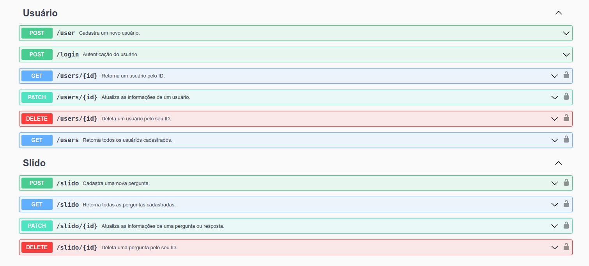

<h1 align="center">
  <p>SLIDO API 🥳</p>
  <p>Api Node.js | Express.js | MongoDB</p>
</h1>

<p align="center">
  <a href="#sobre-wave">Sobre</a>&nbsp;&nbsp;&nbsp;|&nbsp;&nbsp;&nbsp;
  <a href="#como-usar-rocket">Como Usar</a>&nbsp;&nbsp;&nbsp;|&nbsp;&nbsp;&nbsp;
  <a href="#funcionalidades-star">Funcionalidades</a>&nbsp;&nbsp;&nbsp;|&nbsp;&nbsp;&nbsp;
  <a href="#tecnologias-man_technologist">Tecnologias</a>&nbsp;&nbsp;&nbsp;|&nbsp;&nbsp;&nbsp;
  <a href="#padrão-de-commits-barber">Padrão de commits</a>&nbsp;&nbsp;&nbsp;|&nbsp;&nbsp;&nbsp;
  <a href="https://slido-api.vercel.app/" target="_blank">Aplicação na Vercel</a>
</p>
<br/>

<p align="center">
  
<p>

## Sobre :wave:

A `Slido API` oferece recursos para o cadastro de usuários e para o
gerenciamento completo de perguntas e respostas dos clientes. Com ela,
é possível realizar um `CRUD` completo, sendo capaz de criar,
visualizar, editar e remover cada pergunta ou resposta cadastrada.

Além disso, a Slido API permite que os usuários realizem login como `cliente ou admin`,
facilitando o controle de acesso e a gestão de permissões. Com essa funcionalidade, é possível garantir a segurança e a privacidade dos dados cadastrados na plataforma.


## Como Usar :rocket:

**Para acessar a API, utilize o link a seguir:**

[https://slido-api.vercel.app/](https://slido-api.vercel.app/)

Para ter acesso a informações mais detalhadas da Slido API, acesse a documentação através do link abaixo:

[Documentação Slido API](https://slido-api.vercel.app/docs/)


## Funcionalidades :star:

A Slido API trabalha em cima de duas collections do mongoDB:

 - `Users`
 - `Slido`

Em relação ao schema do `Users`, é possível acessar as seguintes rotas:

 - `POST /user`
 > Cria um novo usuário com os dados fornecidos no corpo da requisição, verifica se o email do usuário já existe no banco de dados, realiza a criptografia da senha do usuário e valida os campos do body.

 - `POST /login`
 > Autentica o usuário com email e senha, retorna um token JWT de acesso e valida os campos do body.

 - `GET /users/{id}`
 > Retorna um usuário com o ID especificado, valida se o id é passado como parâmetro na rota e se o token JWT de acesso é válido.

 - `GET /users`
 > Retorna uma lista com todos os usuários cadastrados e valida se o token JWT de acesso é válido.

 - `PATCH /users/{id}`
 > Retorna um usuário atualizado com o ID especificado, valida se o id é passado como parâmetro na rota, se o token JWT de acesso é válido e valida os campos do body.
    > **OBS 👀: Apenas user Admin tem acesso**

 - `DELETE /users/{id}`
 > Deleta o usuário identificado pelo ID fornecido na rota, valida se o id é passado como parâmetro na rota e se o token JWT de acesso é válido.
    > **OBS 👀: Apenas user Admin tem acesso**


```BASH
// Exemplo de acesso para a rota get /users

https://slido-api.onrender.com/users
```

Em relação ao schema do `Slido`, é possível acessar as seguintes rotas:

 - `POST /slido`
 > Cria uma nova pergunta com os dados fornecidos no corpo da requisição, valida se o token JWT de acesso é válido e valida os campos do body.

 - `GET /slido`
 > Retorna uma lista com todas as perguntas cadastradas e valida se o token JWT de acesso é válido.

 - `PATCH /slido/{id}`
 > Retorna as informações atualizadas da pergunta ou resposta, valida se o id é passado como parâmetro na rota, se o token JWT de acesso é válido e valida os campos do body.

 - `DELETE /slido/{id}`
 > Deleta uma pergunta identificada pelo ID fornecido na rota, valida se o id é passado como parâmetro na rota e se o token JWT de acesso é válido.

```BASH
// Exemplo de acesso para a rota get /slido

https://slido-api.onrender.com/slido
```


## Tecnologias :man_technologist:

Segue abaixo a lista de tecnologias utilizada no projeto:

 - `Node`
 > Plataforma de desenvolvimento para criação de aplicações server-side em JavaScript;
 - `Express`
 > Framework web minimalista para Node.js;
 - `Nodemon`
 > Ferramenta que monitora as alterações no código e reinicia o servidor automaticamente;
 - `MongoDB`
 > Banco de dados NoSQL orientado a documentos;
 - `EsLint`
 > Ferramenta para análise estática de código JavaScript;
 - `Bcrypt`
 > Biblioteca para criptografia de senhas;
 - `Json Web Token (JWT)`
 > Padrão de token de acesso utilizado para autenticação e autorização em aplicações web;
 - `Swagger`
 > Ferramenta para documentação de APIs;
 - `Vercel`
 > Plataforma de hospedagem voltada para aplicações web modernas e escaláveis.


## Padrão de commits :barber:

Durante o desenvolvimento resolvi utilizar a documentação do **Conventional Commits**, para manter meus commits mais semânticos e fáceis de compreender.

<table>
  <thead>
    <tr>
      <th>Tipo de commit</th>
      <th>Emojis</th>
      <th>Palavra-chave</th>
    </tr>
  </thead>
 <tbody>
    <tr>
      <td>Acessibilidade</td>
      <td>♿ <code>:wheelchair:</code></td>
      <td></td>
    </tr>
    <tr>
      <td>Adicionando um teste</td>
      <td>✅ <code>:white_check_mark:</code></td>
      <td><code>test</code></td>
    </tr>
    <tr>
      <td>Adicionando uma dependência</td>
      <td>➕ <code>:heavy_plus_sign:</code></td>
      <td><code>build</code></td>
    </tr>
    <tr>
      <td>Alterações de revisão de código</td>
      <td>👌 <code>:ok_hand:</code></td>
      <td><code>style</code></td>
    </tr>
    <tr>
      <td>Animações e transições</td>
      <td>💫 <code>:dizzy:</code></td>
      <td></td>
    </tr>
    <tr>
      <td>Bugfix</td>
      <td>🐛 <code>:bug:</code></td>
      <td><code>fix</code></td>
    </tr>
    <tr>
      <td>Comentários</td>
      <td>💡 <code>:bulb:</code></td>
      <td><code>docs</code></td>
    </tr>
    <tr>
      <td>Commit inicial</td>
      <td>🎉 <code>:tada:</code></td>
      <td><code>init</code></td>
    </tr>
    <tr>
      <td>Configuração</td>
      <td>🔧 <code>:wrench:</code></td>
      <td><code>chore</code></td>
    </tr>
    <tr>
      <td>Deploy</td>
      <td>🚀 <code>:rocket:</code></td>
      <td></td>
    </tr>
    <tr>
      <td>Documentação</td>
      <td>📚 <code>:books:</code></td>
      <td><code>docs</code></td>
    </tr>
    <tr>
      <td>Em progresso</td>
      <td>🚧 <code>:construction:</code></td>
      <td></td>
    </tr>
    <tr>
      <td>Estilização de interface</td>
      <td>💄 <code>:lipstick:</code></td>
      <td><code>feat</code></td>
    </tr>
    <tr>
      <td>Infraestrutura</td>
      <td>🧱 <code>:bricks:</code></td>
      <td><code>ci</code></td>
    </tr>
    <tr>
      <td>Lista de ideias (tasks)</td>
      <td>🔜 <code> :soon: </code></td>
      <td></td>
    </tr>
    <tr>
      <td>Mover/Renomear</td>
      <td>🚚 <code>:truck:</code></td>
      <td><code>chore</code></td>
    </tr>
    <tr>
      <td>Novo recurso</td>
      <td>✨ <code>:sparkles:</code></td>
      <td><code>feat</code></td>
    </tr>
    <tr>
      <td>Package.json em JS</td>
      <td>📦 <code>:package:</code></td>
      <td><code>build</code></td>
    </tr>
    <tr>
      <td>Performance</td>
      <td>⚡ <code>:zap:</code></td>
      <td><code>perf</code></td>
    </tr>
    <tr>
        <td>Refatoração</td>
        <td>♻️ <code>:recycle:</code></td>
        <td><code>refactor</code></td>
    </tr>
    <tr>
      <td>Removendo um arquivo</td>
      <td>🔥 <code>:fire:</code></td>
      <td></td>
    </tr>
    <tr>
      <td>Removendo uma dependência</td>
      <td>➖ <code>:heavy_minus_sign:</code></td>
      <td><code>build</code></td>
    </tr>
    <tr>
      <td>Responsividade</td>
      <td>📱 <code>:iphone:</code></td>
      <td></td>
    </tr>
    <tr>
      <td>Revertendo mudanças</td>
      <td>💥 <code>:boom:</code></td>
      <td><code>fix</code></td>
    </tr>
    <tr>
      <td>Segurança</td>
      <td>🔒️ <code>:lock:</code></td>
      <td></td>
    </tr>
    <tr>
      <td>SEO</td>
      <td>🔍️ <code>:mag:</code></td>
      <td></td>
    </tr>
    <tr>
      <td>Tag de versão</td>
      <td>🔖 <code>:bookmark:</code></td>
      <td></td>
    </tr>
    <tr>
      <td>Teste de aprovação</td>
      <td>✔️ <code>:heavy_check_mark:</code></td>
      <td><code>test</code></td>
    </tr>
    <tr>
      <td>Testes</td>
      <td>🧪 <code>:test_tube:</code></td>
      <td><code>test</code></td>
    </tr>
    <tr>
      <td>Texto</td>
      <td>📝 <code>:pencil:</code></td>
      <td></td>
    </tr>
    <tr>
      <td>Tipagem</td>
      <td>🏷️ <code>:label:</code></td>
      <td></td>
    </tr>
    <tr>
      <td>Tratamento de erros</td>
      <td>🥅 <code>:goal_net:</code></td>
      <td></td>
    </tr>
  </tbody>
</table>


## Exemplos de commits 👌

<table>
  <thead>
    <tr>
      <th>Comando git</th>
      <th>Resultado no GitHub</th>
    </tr>
  </thead>
 <tbody>
    <tr>
      <td>
        <code>git commit -m ":tada: Commit inicial"</code>
      </td>
      <td>🎉 Commit inicial</td>
    </tr>
    <tr>
      <td>
        <code>git commit -m ":books: docs: Atualizaçao do README"</code>
      </td>
      <td>📚 docs: Atualizaçao do README</td>
    </tr>
    <tr>
      <td>
        <code>git commit -m ":bug: fix: Loop infinito na linha 50"</code>
      </td>
      <td>🐛 fix: Loop infinito na linha 50</td>
    </tr>
    <tr>
      <td>
        <code>git commit -m ":sparkles: feat: Pagina de login"</code>
      </td>
      <td>✨ feat: Pagina de login</td>
    </tr>
    <tr>
      <td>
        <code>git commit -m ":bricks: ci: Modificaçao no Dockerfile"</code>
      </td>
      <td>🧱 ci: Modificaçao no Dockerfile</td>
    </tr>
    <tr>
      <td>
        <code>git commit -m ":recycle: refactor: Passando para arrow functions"</code>
      </td>
      <td>♻️ refactor: Passando para arrow functions</td>
    </tr>
    <tr>
      <td>
        <code>git commit -m ":zap: perf: Melhoria no tempo de resposta"</code>
      </td>
      <td>⚡ perf: Melhoria no tempo de resposta</td>
    </tr>
    <tr>
      <td>
        <code>git commit -m ":boom: fix: Revertendo mudanças ineficientes"</code>
      </td>
      <td>💥 fix: Revertendo mudanças ineficientes</td>
    </tr>
    <tr>
      <td>
        <code>git commit -m ":lipstick: feat: Estilizaçao CSS do formulario"</code>
      </td>
      <td>💄 feat: Estilizaçao CSS do formulario</td>
    </tr>
    <tr>
      <td>
        <code>git commit -m ":test_tube: test: Criando novo teste"</code>
      </td>
      <td>🧪 test: Criando novo teste</td>
    </tr>
    <tr>
      <td>
        <code>git commit -m ":bulb: docs: Comentários novos"</code>
      </td>
      <td>💡 docs: Comentários novos</td>
    </tr>
  </tbody>
</table>
